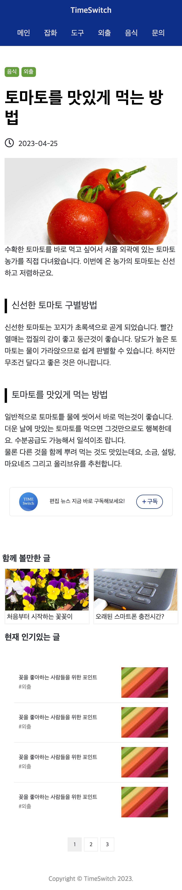

# blog
# 작성자 : 최은혜
# 설명
## 적응형 블로그
git-pages : https://choieh.github.io/pf-blog/

### spec
- HTML5, CSS, Sass, js
- 크로스브라우징 : Chrome, firefox, edge, safari
- 미디어쿼리 : 모바일 우선(break point: 768px, 1280px)
- 바닐라 js를 활용한 슬라이드 기능 추가

### screen shot

pc

mobile
<!--  -->

